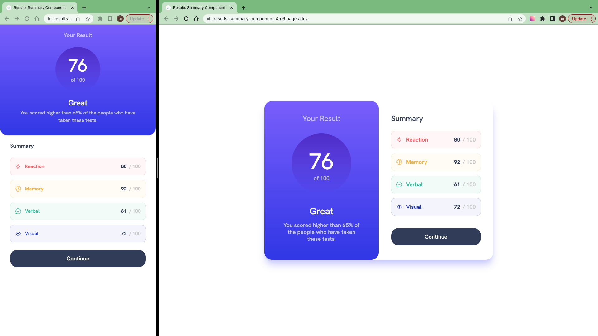

# Frontend Mentor - Results summary component solution

This is a solution to the [Results summary component challenge on Frontend Mentor](https://www.frontendmentor.io/challenges/results-summary-component-CE_K6s0maV).

## Table of contents

- [Overview](#overview)
  - [The challenge](#the-challenge)
  - [Screenshot](#screenshot)
  - [Links](#links)
- [My process](#my-process)
  - [Work time](#work-time)
  - [Built with](#built-with)
  - [What I learned](#what-i-learned)
  - [Useful resources](#useful-resources)
- [Author](#author)
- [Acknowledgments](#acknowledgments)

## Overview

### The challenge

Users should be able to:

- View the optimal layout for the interface depending on their device's screen size
- See hover and focus states for all interactive elements on the page

### Screenshot

### Links

- Solution: [frontendmentor.io](https://www.frontendmentor.io/solutions/results-summary-component-CI-Nr87wtD)

- Live Site: [cloudflare](https://results-summary-component-4m6.pages.dev/)

## My process

- Prepare Project (Download assets, Install Vite, Install TailwindCss, Initialize git, ...)
- Create & style component
- Publish

### Work Time

- [My Clockify Report](https://app.clockify.me/shared/6486e8f3e79f0e1e7b889bb2)

### Built with

- [React](https://react.dev/)
- [TailwindCss](https://tailwindcss.com/)

### What I learned

- Show only rounded corner borders
- Make a smooth transition on linear gradient

### Useful resources

- [Transitioning gradients](https://keithjgrant.com/posts/2017/07/transitioning-gradients/)

- [Show only corner borders](https://stackoverflow.com/a/14388399)

## Author

- Frontend Mentor - [@siavhnz](https://www.frontendmentor.io/profile/siavhnz)

- github - [@siavhnz](https://www.github.com/siavhnz)

## Acknowledgments

Thanks To

[Frontendmentor.io](https://www.frontendmentor.io/challenges) - for their Excitement challenges  

[Perfect Pixel](https://chrome.google.com/webstore/detail/perfectpixel-by-welldonec/dkaagdgjmgdmbnecmcefdhjekcoceebi?hl=en) - for such a great extension